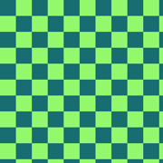
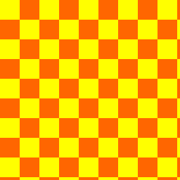
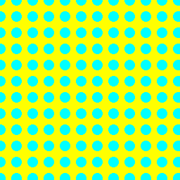
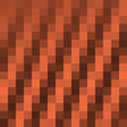

<p align="center">
  <a href="https://honeypotter.benjamintenwolde.com/">
    
  </a>
</p>

# HoneyPotter

**Synthetic distractor factory for robustness experiments.** Honeypotter crafts non-semantic pattern families—checkers, stripes, blobs, textures, and ViT-friendly moirés—that lure vision models into confident mistakes. Use it to benchmark steal-rate, calibration, and OOD behaviour without collecting new data.

<p align="center">
  <a href="https://benlten.github.io/HoneyPotter">Website</a> ·
  <a href="https://github.com/benlten/HoneyPotter">GitHub</a> ·
  <a href="https://github.com/benlten/HoneyPotter/issues">Issues</a>
</p>

## Highlights
- **Pattern families**: `checker`, `stripes`, `dots`, `blob`, `solid`, optional `circle`, `perlin`, `texture`, and `moire`
- **ViT-aligned moirés**: interference bands quantised to configurable `N×N` grids (default `16×16`) for patch-consistent signals
- **Color controls**: grayscale, high-contrast BW, neon OOD palettes, or gamut-constrained RGB via histogram/GMM checks
- **Patterns-only export**: add `--patterns_only` to dump flat texture banks without label metadata
- **Seeded generation**: deterministic configs with reproducible blur, frequency, and hue parameters baked into category names

<p align="center">
  
  
  
  <br/>
  
  
  
  <br/>
  
  
  
  <br/>
  
  
  
  
  
</p>

## Installation

```bash
pip install honeypotter
```

Development install:

```bash
git clone https://github.com/benlten/HoneyPotter.git
cd HoneyPotter
pip install -e .[dev]
```

## CLI Quick Start

```bash
# 20 categories × 100 images each
honeypotter generate --out ./honeypots \
  --n_categories 20 --per_class 100 \
  --families checker,stripes,dots,blob,solid \
  --color_mode ood --seed 0

# ViT-targeted moiré bank
honeypotter generate --out ./moire_vit \
  --families moire --enable_moire \
  --n_categories 25 --per_class 50 \
  --moire_grid_size 16 \
  --no-moire-random-hue --moire_hues 15,195,305

# Pattern tiles only (no labels/metadata)
honeypotter generate --out ./texture_bank \
  --families moire,stripes \
  --n_categories 12 --per_class 8 \
  --patterns_only
```

Outputs include per-category folders plus `labelmap.json`, `labels.txt`, and `metadata.csv` unless `--patterns_only` is set.

## Programmatic API

```python
from honeypotter import GenerateDistractor, CategorySpec, ColorSampler

spec = CategorySpec.default(
    families=["checker", "stripes", "dots", "blob", "solid"],
    n_categories=50,
    pattern_blur_sigma=1.0,
    color_mode="ood",
)

sampler = ColorSampler(seed=42)

gen = GenerateDistractor(
    image_size=224,
    spec=spec,
    color_sampler=sampler,
    seed=42,
)

img, name = gen()  # PIL.Image.Image, e.g. "checker_sz16_ood"
img.save(f"{name}.png")
```

For ViT-aligned moirés:

```python
spec = CategorySpec.default(
    families=["moire"],
    n_categories=10,
    moire_grid_size=16,
    moire_random_hue=False,
    moire_hue_list=[15.0, 195.0, 305.0],
)
```

## Evaluation Guidance

1. **Extend the label space**: append honeypot class names to your dataset (e.g., ImageNet-1k → 1000 + K honeypots).
2. **Train clean, evaluate mixed**: honeypots stay out of the training split; blend them into validation/test to measure steal-rate.
3. **Report**: clean accuracy, honeypot steal-rate, calibration/ECE on both clean and distractor sets.

## Project Structure

- `src/honeypotter/` – generator, CLI, and color utilities
- `tests/` – pytest suite (includes moiré grid + patterns-only coverage)
- `docs/` – GitHub Pages site served at <https://benlten.github.io/HoneyPotter>
- `examples/` – scripts for palette vs OOD comparisons and integration demos

## Contributing

Bug reports and PRs are welcome! Please open an issue and run `pytest` before submitting changes.

## License

MIT License © Honeypotter contributors
